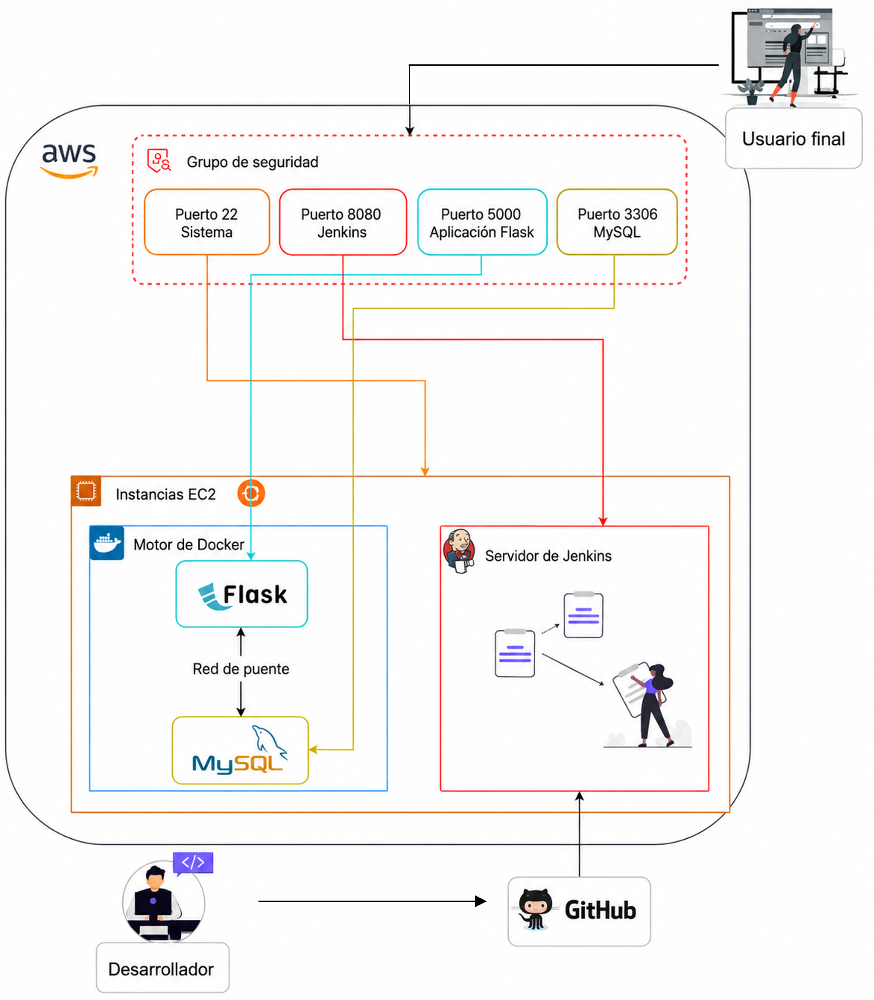
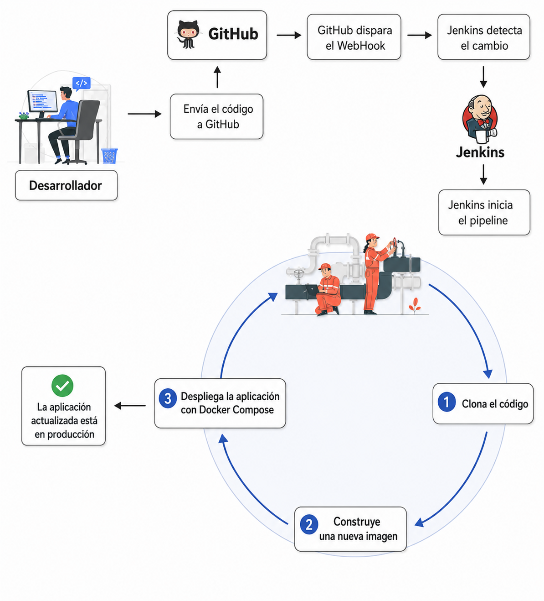

# DevOps: Pipeline CI/CD para una Aplicación Flask de 2 Capas en AWS

### **Tabla de Contenido**
1. [Descripción General del Proyecto](#1-descripción-general-del-proyecto)
2. [Diagrama de Arquitectura](#2-diagrama-de-arquitectura)
3. [Paso 1: Preparación de la Instancia AWS EC2](#3-paso-1-preparación-de-la-instancia-aws-ec2)
4. [Paso 2: Instalación de Dependencias en EC2](#4-paso-2-instalación-de-dependencias-en-ec2)
5. [Paso 3: Instalación y Configuración de Jenkins](#5-paso-3-instalación-y-configuración-de-jenkins)
6. [Paso 4: Configuración del Repositorio GitHub](#6-paso-4-configuración-del-repositorio-github)
7. [Paso 5: Creación y Ejecución del Pipeline de Jenkins](#7-paso-5-creación-y-ejecución-del-pipeline-de-jenkins)
8. [Conclusión](#8-conclusión)
9. [Diagrama de Infraestructura](#9-diagrama-de-infraestructura)
10. [Diagrama de Flujo de Trabajo](#10-diagrama-de-flujo-de-trabajo)

---

### **1. Descripción General del Proyecto**
Este documento describe el proceso paso a paso para desplegar una aplicación web de 2 capas (Flask + MySQL) en una instancia AWS EC2. El despliegue está containerizado utilizando Docker y Docker Compose. Se establece un pipeline completo de CI/CD utilizando Jenkins para automatizar el proceso de construcción y despliegue cada vez que se realiza un nuevo push de código a un repositorio GitHub.

---

### **2. Diagrama de Arquitectura**

```text
+-----------------+      +----------------------+      +-----------------------------+
|   Desarrollador |----->|  Repositorio GitHub |-----> |       Servidor Jenkins      |
| (realiza push)  |      | (Gestión de Código) |       |        (en AWS EC2)         |
+-----------------+      +----------------------+      |                             |
                                                       | 1. Clona el repositorio     |
                                                       | 2. Construye imagen Docker  |
                                                       | 3. Ejecuta Docker Compose   |
                                                       +--------------+--------------+
                                                                      |
                                                                      | Despliega
                                                                      v
                                                       +-----------------------------+
                                                       |     Servidor Aplicación     |
                                                       |       (Misma AWS EC2)       |
                                                       |                             |
                                                       | +-------------------------+ |
                                                       | | Contenedor Docker Flask | |
                                                       | +-------------------------+ |
                                                       |              |              |
                                                       |              v              |
                                                       | +-------------------------+ |
                                                       | | Contenedor Docker MySQL | |
                                                       | +-------------------------+ |
                                                       +-----------------------------+
```

---

### **3. Paso 1: Preparación de la Instancia AWS EC2**

1. **Lanzar una Instancia EC2**
2. **Configurar el Security Group**
3. **Conectarse a la Instancia EC2**

```bash
ssh -i /llave.pem ubuntu@<ip-publica-ec2>
```

---

### **4. Paso 2: Instalación de Dependencias en EC2**

```bash
sudo apt update && sudo apt upgrade -y
sudo apt install git docker.io docker-compose-v2 -y
sudo systemctl start docker
sudo systemctl enable docker
sudo usermod -aG docker $USER
newgrp docker
```

---

### **5. Paso 3: Instalación y Configuración de Jenkins**

```bash
sudo apt install openjdk-17-jdk -y
```

```bash
curl -fsSL https://pkg.jenkins.io/debian-stable/jenkins.io-2026.key | sudo tee /usr/share/keyrings/jenkins-keyring.asc > /dev/null

echo deb [signed-by=/usr/share/keyrings/jenkins-keyring.asc] https://pkg.jenkins.io/debian-stable binary/ | sudo tee /etc/apt/sources.list.d/jenkins.list > /dev/null

sudo apt update
sudo apt install jenkins -y
```

```bash
sudo systemctl start jenkins
sudo systemctl enable jenkins
```

```bash
sudo cat /var/lib/jenkins/secrets/initialAdminPassword
```

```bash
sudo usermod -aG docker jenkins
sudo systemctl restart jenkins
```

---

### **6. Paso 4: Configuración del Repositorio GitHub**

#### **Dockerfile**

```dockerfile
FROM python:3.9-slim

WORKDIR /app

RUN apt-get update && apt-get install -y gcc default-libmysqlclient-dev pkg-config && \
    rm -rf /var/lib/apt/lists/*

COPY requirements.txt .

RUN pip install --no-cache-dir -r requirements.txt

COPY . .

EXPOSE 5000

CMD ["python", "app.py"]
```

#### **docker-compose.yml**

```yaml
version: "3.8"

services:
  mysql:
    container_name: mysql
    image: mysql
    environment:
      MYSQL_DATABASE: "devops"
      MYSQL_ROOT_PASSWORD: "root"

  flask:
    build:
      context: .
```

#### **Jenkinsfile**

```groovy
pipeline {
    agent any

    stages {
        stage('Clone Code') {
            steps {
                git branch: 'main', url: 'https://github.com/David-pixel-hub/DevOps-AplicacionWeb2Capas'
            }
        }

        stage('Build Docker Image') {
            steps {
                sh 'docker build -t flask-app:latest .'
            }
        }

        stage('Deploy with Docker Compose') {
            steps {
                sh 'docker compose down || true'
                sh 'docker compose up -d --build'
            }
        }
    }
}
```

---

### **7. Paso 5: Creación y Ejecución del Pipeline de Jenkins**

1. Crear un nuevo Pipeline Job en Jenkins.
2. Configurar el Pipeline desde SCM.
3. Ejecutar el Pipeline con **Build Now**.
4. Verificar el despliegue.

```bash
docker ps
```

---

### **8. Conclusión**

El pipeline CI/CD ahora está completamente operativo. Cualquier `git push` a la rama `main` activará automáticamente el pipeline de Jenkins para construir una nueva imagen Docker y desplegar la aplicación actualizada.

---

### **9. Diagrama de Infraestructura**

```html

```

---

### **10. Diagrama de Flujo de Trabajo**

```html

```
